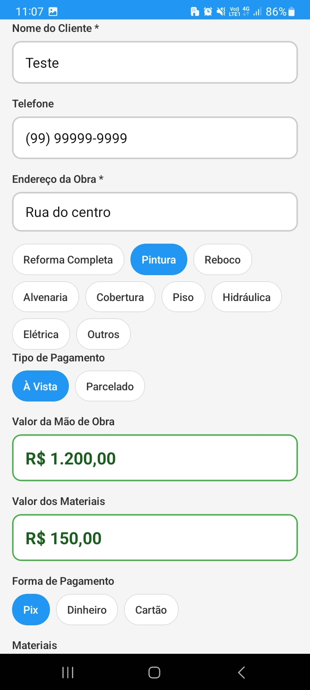
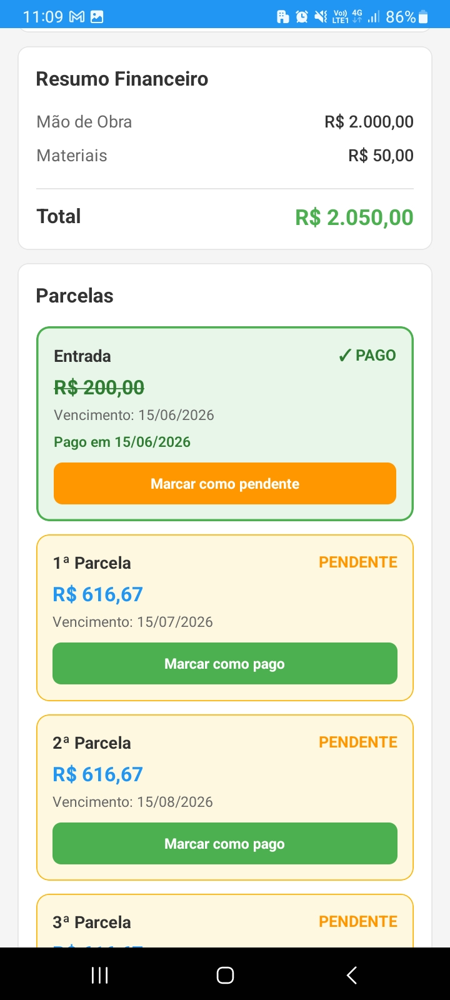

# App de Controle de Pedidos

Aplicativo desenvolvido em React Native para gerenciamento de serviços, pedidos e pagamentos de obras.

---

## Screenshots

### Lista de pedidos


### Cadastro do pedido



### Controle de parcelas



## Funcionalidades

- Cadastro de pedidos
- Controle de status da obra
- Controle financeiro
- Parcelamento
- Registro de parcelas pagas
- Busca de pedidos
- Filtros por status
- Persistência local com AsyncStorage

---

## Tecnologias utilizadas

- React Native
- TypeScript
- AsyncStorage

## Como executar

```bash
npm install
```

```bash
npx react-native run-android
```

---

## Objetivo do projeto

Projeto criado para praticar:
- React Native
- TypeScript
- gerenciamento de estado
- persistência local
- regras de negócio
- organização de componentes
